# Detailed Flow Guide — ccpoke

Tài liệu mô tả chi tiết **từng bước** trong mọi luồng hoạt động của ccpoke.

---

## Mục lục

1. [Tổng quan hệ thống](#1-tổng-quan-hệ-thống)
2. [Khởi động (Boot Sequence)](#2-khởi-động-boot-sequence)
3. [Flow 1: Stop Hook → Notification](#3-flow-1-stop-hook--notification)
4. [Flow 2: Two-Way Chat](#4-flow-2-two-way-chat)
5. [Flow 3: Session Lifecycle](#5-flow-3-session-lifecycle)
6. [Flow 4: Message Queue & Drain](#6-flow-4-message-queue--drain)
7. [Persistence — File nào ghi ở đâu](#7-persistence--file-nào-ghi-ở-đâu)
8. [Module Dependency Map](#8-module-dependency-map)
9. [Security Model](#9-security-model)

---

## 1. Tổng quan hệ thống


**Tom tat:** ccpoke la cau noi giua AI agent (chay trong tmux tren may local) va Telegram bot (tren dien thoai). Khi agent xong viec → hook trigger → parse transcript → gui notification. User co the reply lai → inject vao tmux session.

---

## 2. Khoi dong (Boot Sequence)


---

## 3. Flow 1: Stop Hook → Notification

**Kich ban:** Claude Code trong tmux hoan thanh response → User nhan notification tren Telegram.

```mermaid
sequenceDiagram
    participant CC as Claude Code<br/>(trong tmux)
    participant SH as Shell Script<br/>(hook script)
    participant EX as Express Server<br/>(port 9377)
    participant AH as AgentHandler
    participant PR as Provider<br/>(ClaudeCode)
    participant RS as ResponseStore
    participant TG as Telegram Channel
    participant PH as Dien thoai

    CC->>SH: Trigger Stop hook<br/>(stdin: JSON)
    Note over SH: Doc JSON tu stdin<br/>Lay tmux target<br/>tu $TMUX_PANE

    SH->>EX: curl POST /hook/stop<br/>Header: X-CCPoke-Secret<br/>Body: {session_id, transcript_path, cwd}
    EX->>EX: Validate secret header
    EX-->>SH: 200 OK (ngay lap tuc)
    Note over EX: setImmediate<br/>xu ly async

    EX->>AH: handleStopEvent(agentName, rawEvent)
    Note over AH: Wait 500ms<br/>(transcript settle delay)

    AH->>PR: parseEvent(rawEvent)
    Note over PR: 1. Validate fields<br/>2. parseTranscript(path)<br/> - Doc .jsonl (NDJSON)<br/> - Tim role=assistant cuoi<br/> - Trich xuat summary,<br/> tokens, model, duration<br/>3. extractProjectName(path)<br/>4. collectGitChanges(cwd)<br/> - git diff --name-status HEAD
    PR-->>AH: AgentEventResult

    AH->>AH: resolveSessionId<br/>tmuxTarget to sessionId

    AH->>AH: onStopHook(sessionId)<br/>Drain message queue

    AH->>RS: save(responseData)
    Note over RS: Generate ID (8 chars)<br/>Ghi ~/.ccpoke/responses/{id}.json<br/>Cleanup: xoa >24h, giu max 100
    RS-->>AH: id

    AH->>AH: Build response URL<br/>mini-app-url/response/?id={id}

    AH->>TG: sendNotification(data, url)
    Note over TG: Format MarkdownV2:<br/>📦 project-name<br/>🐾 Agent · ⏱ Duration<br/>Summary...<br/>📊 Tokens · 🤖 Model<br/>📝 Git changes

    TG->>TG: Split neu > 4096 chars
    TG->>TG: Build inline keyboard<br/>[View Details] [Chat]

    TG->>PH: bot.sendMessage()<br/>parse_mode: MarkdownV2

    Note over PH: User nhan notification<br/>voi summary, stats,<br/>git changes, 2 nut bam
```



### Chi tiet tung buoc

**Buoc 1: Claude Code trigger hook**

Khi Claude Code hoan thanh 1 response, no goi hook `Stop` da duoc cau hinh trong `~/.claude/settings.json`:

```json
{
  "hooks": {
    "Stop": [{
      "matcher": "",
      "hooks": [{
        "type": "command",
        "command": "~/.ccpoke/hooks/claude-code-stop.sh"
      }]
    }]
  }
}
```

Claude Code truyen JSON qua **stdin** cho script:

```json
{
  "session_id": "abc-123-def",
  "transcript_path": "/Users/you/.claude/projects/2F...2F.../00001.jsonl",
  "cwd": "/Users/you/my-project"
}
```

**Buoc 2: Shell script gui HTTP request**

File `~/.ccpoke/hooks/claude-code-stop.sh` doc JSON tu stdin, lay tmux target, va `curl POST` den `http://127.0.0.1:9377/hook/stop` voi header `X-CCPoke-Secret`.

**Buoc 3: Express server nhan request**

- Kiem tra header `X-CCPoke-Secret` → khop `config.hook_secret`?
- Lay `agentName` tu query param (default: `"claude-code"`)
- `setImmediate(() => handler.handleStopEvent(...))` — fire-and-forget
- Return `200 OK` ngay lap tuc

> **Tai sao `setImmediate`?** De hook script khong bi timeout. Response tra ve ngay, xu ly nang chay async.

**Buoc 4: AgentHandler parse event** (`src/agent/agent-handler.ts`)

1. Lay provider tu `AgentRegistry` → `ClaudeCodeProvider`
2. Cho settle delay (`await sleep(500)`) — transcript file co the chua flush xong
3. `provider.parseEvent(rawEvent)`:
   - Validate: co `session_id`, `transcript_path`, `cwd`?
   - `parseTranscript(path)` — doc file `.jsonl`, parse NDJSON, trich xuat summary/tokens/model/duration
   - `extractProjectName(path)` — decode path → lay basename
   - `collectGitChanges(cwd)` — chay `git diff --name-status HEAD`
4. Resolve chat session (tmuxTarget → sessionId)
5. Drain message queue (neu co)
6. `responseStore.save()` → ghi file `~/.ccpoke/responses/{id}.json`
7. Build response URL cho Telegram Mini App
8. `channel.sendNotification(data, url)`

**Buoc 5: Telegram Channel format va gui** (`src/channel/telegram/`)

1. Format message (MarkdownV2) voi project name, agent, duration, summary, tokens, model, git changes
2. Split neu > 4096 chars (Telegram limit)
3. Build inline keyboard: `[View Details]` + `[Chat]`
4. `bot.sendMessage()` voi `parse_mode: "MarkdownV2"`
5. Fallback: neu MarkdownV2 loi → gui lai plain text

---

## 4. Flow 2: Two-Way Chat

**Kich ban:** User nhan nut "Chat" → go tin nhan → tin nhan duoc inject vao Claude Code session.

```mermaid
sequenceDiagram
    participant U as User<br/>(Phone)
    participant BOT as Telegram Bot
    participant PRS as PendingReply<br/>Store
    participant SSM as SessionState<br/>Manager
    participant TB as TmuxBridge
    participant CC as Claude Code<br/>(tmux)

    U->>BOT: Nhan nut 💬 Chat<br/>callback: chat:sess123
    BOT->>U: my-project<br/>force_reply: true
    BOT->>PRS: set(chatId, msgId, sess123, project)<br/>TTL: 10 phut

    U->>BOT: Reply: fix bug X
    BOT->>PRS: get(chatId, replyToMsgId)
    PRS-->>BOT: {sessionId: sess123, project}

    BOT->>SSM: injectMessage sess123, fix bug X

    alt Session IDLE
        SSM->>TB: sendKeys target, fix bug X
        TB->>CC: tmux send-keys fix bug X Enter
        SSM->>SSM: updateState to BUSY
        SSM-->>BOT: {sent: true}
        BOT->>U: ✅ Message sent to my-project
    else Session BUSY
        SSM->>SSM: enqueue message (max 20)
        SSM-->>BOT: {queued: true, position: 2}
        BOT->>U: ⏳ Queued (position 2)
    else Pane Dead
        SSM-->>BOT: {tmuxDead: true}
        BOT->>U: ❌ Session not found
    else User Typing on Desktop
        SSM-->>BOT: {desktopActive: true}
        BOT->>U: ⌨️ User is typing on desktop
    end
```



### Chi tiet tung buoc

**Buoc 1:** User nhan nut "💬 Chat" → Telegram gui `callback_query` voi `data: "chat:sess123"`.

**Buoc 2:** Bot gui prompt message voi `force_reply: true` → Telegram tu dong mo reply mode.

**Buoc 3:** Luu vao `PendingReplyStore` — key `"chatId:messageId"` → `{sessionId, project, createdAt}`. Tu xoa sau 10 phut (setTimeout).

**Buoc 4:** User go va gui tin nhan. Telegram gui message voi `reply_to_message.message_id` tro den prompt.

**Buoc 5:** Lookup `pendingReplyStore.get(chatId, replyToMessageId)` → lay sessionId.

**Buoc 6:** `sessionStateManager.injectMessage(sessionId, text)`:

```typescript
// session-state.ts
injectMessage(sessionId, text) {
  const session = sessionMap.getBySessionId(sessionId);
  if (!session) return { sessionNotFound: true };

  if (!isPaneAlive(session.tmuxTarget)) return { tmuxDead: true };

  if (tmuxBridge.hasUncommittedInput(session.tmuxTarget))
    return { desktopActive: true };

  // Session idle → gui ngay
  if (session.state === 'idle') {
    tmuxBridge.sendKeys(session.tmuxTarget, text);
    sessionMap.updateState(sessionId, 'busy');
    return { sent: true };
  }

  // Session busy → queue
  if (queue.length >= MAX_QUEUE_SIZE) return { queueFull: true };
  queue.push({ text, timestamp: Date.now() });
  return { queued: true, position: queue.length };
}
```

**Buoc 7:** `tmuxBridge.sendKeys()` escape shell metacharacters (`$ " \ ; `` `) va chay `tmux send-keys`. Claude Code nhan text input nhu user go truc tiep.

---

## 5. Flow 3: Session Lifecycle

### Phat hien session moi

Co **2 cach** session duoc dang ky:


### Session state machine


**IDLE:** Co the nhan message moi va gui vao tmux ngay.
**BUSY:** Message moi se duoc enqueue (max 20).

---

## 6. Flow 4: Message Queue & Drain

Khi agent dang **busy** ma user gui nhieu tin nhan:


**Gioi han:**

| Thong so | Gia tri | Ghi chu |
|----------|---------|---------|
| `MAX_QUEUE_SIZE` | 20 messages | Tra ve `queueFull` neu vuot |
| `MAX_MESSAGE_LENGTH` | 10,000 chars | Per message |
| Persistence | Memory only | Mat neu restart bot |

---

## 7. Persistence — File nao ghi o dau

### Ban do file I/O


### Ai doc/ghi file nao — Quick reference

| File | Doc boi | Ghi boi | Khi nao |
|------|---------|---------|---------|
| `~/.ccpoke/config.json` | `ConfigManager.load()` | Setup wizard, auto-repair | Boot, setup |
| `~/.ccpoke/state.json` | `TelegramChannel` | `TelegramChannel` | Boot, `/start` command |
| `~/.ccpoke/sessions.json` | `SessionMap.load()` | `SessionMap.save()` | Boot, moi 15s, register, shutdown |
| `~/.ccpoke/responses/{id}.json` | `GET /api/responses/:id` | `ResponseStore.save()` | Moi stop hook |
| `~/.ccpoke/hooks/*.sh` | Claude Code (exec) | `ClaudeCodeInstaller` | Setup, ensureHooks |
| `~/.claude/settings.json` | `ClaudeCodeInstaller` | `ClaudeCodeInstaller` | Setup, verify |
| `~/.claude/projects/**/*.jsonl` | `ClaudeCodeParser` | Claude Code (tu ghi) | Moi stop hook |

### Pattern ghi file an toan (Atomic Write)

```
1. writeFileSync(path + '.tmp', data)   ← Ghi vao file tam
2. renameSync(path + '.tmp', path)      ← Rename atomic
```

> **Tai sao?** Neu process crash giua chung, file goc khong bi corrupt. Chi file `.tmp` bi hong.

---

## 8. Module Dependency Map


### Ai goi ai — Quick reference

| Caller | Callee | Khi nao |
|--------|--------|---------|
| `index.ts` | `ConfigManager.load()` | Boot |
| `index.ts` | `AgentProvider.installHook()` | Boot (ensure hooks) |
| `index.ts` | `SessionMap.load()` | Boot |
| `index.ts` | `SessionMap.startPeriodicScan()` | Boot |
| `index.ts` | `ApiServer.start()` | Boot |
| `index.ts` | `TelegramChannel.initialize()` | Boot |
| `ApiServer` | `AgentHandler.handleStopEvent()` | POST /hook/stop |
| `ApiServer` | `AgentHandler.handleSessionStart()` | POST /hook/session-start |
| `AgentHandler` | `AgentProvider.parseEvent()` | Stop hook |
| `AgentHandler` | `ChatSessionResolver.resolveSessionId()` | Stop hook |
| `AgentHandler` | `ResponseStore.save()` | Stop hook |
| `AgentHandler` | `NotificationChannel.sendNotification()` | Stop hook |
| `TelegramChannel` | `PendingReplyStore.set/get()` | Chat flow |
| `TelegramChannel` | `SessionStateManager.injectMessage()` | Chat flow |
| `SessionStateManager` | `TmuxBridge.sendKeys()` | Inject text |
| `SessionMap` | `TmuxScanner.scanClaudePanes()` | Periodic scan |

---

## 9. Security Model


---

## Tong ket — Mot vong doi hoan chinh


